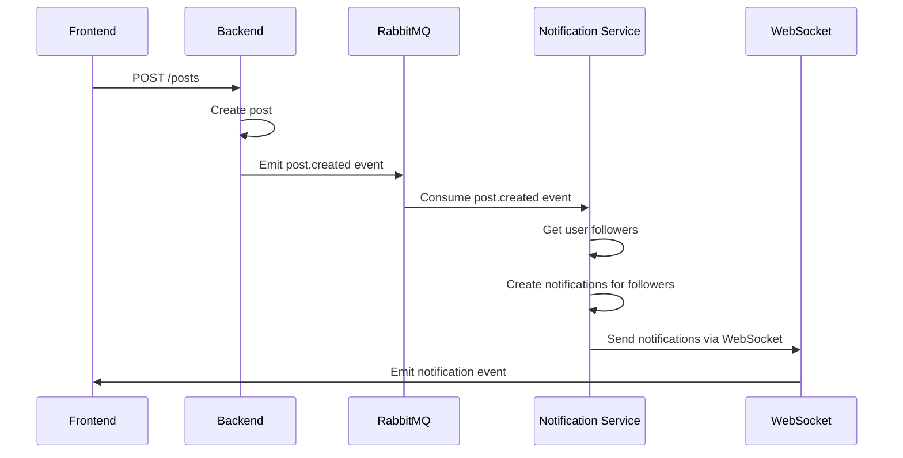

# CodeConnect Notification System

A real-time notification system built with NestJS, Socket.IO, and RabbitMQ for seamless user engagement and communication.

## 🚀 Features

- **Real-time Notifications**: Instant WebSocket-based notifications
- **Multiple Notification Types**: Posts, reactions, comments, follows, mentions
- **Scalable Architecture**: Microservices pattern with RabbitMQ
- **User Following System**: Notify followers of user activities
- **Mention System**: Tag users in posts and comments
- **Message Notifications**: Real-time chat notifications
- **Notification Management**: Mark as read, delete old notifications

## 📋 Notification Types

| Type | Description | Trigger |
|------|-------------|---------|
| `POST_CREATED` | New post by followed user | User creates post |
| `POST_REACTION` | Reaction on user's post | Someone reacts to post |
| `COMMENT_ADDED` | Comment on user's post | Someone comments on post |
| `COMMENT_REACTION` | Reaction on user's comment | Someone reacts to comment |
| `FOLLOWED_USER` | New follower | Someone follows user |
| `MESSAGE_RECEIVED` | New message | Someone sends message |
| `USER_MENTIONED` | User mentioned in post/comment | User tagged with @ |

## 🏗️ Architecture

```
┌─────────────────┐    ┌─────────────────┐    ┌─────────────────┐
│   Frontend      │    │   Backend       │    │   RabbitMQ      │
│   (NextJS)   │◄──►│   (NestJS)      │◄──►│   (Message      │
│                 │    │                 │    │    Broker)      │
└─────────────────┘    └─────────────────┘    └─────────────────┘
                              │
                              ▼
                       ┌─────────────────┐
                       │   MongoDB       │
                       │   (Database)    │
                       └─────────────────┘
```

## 🛠️ Technology Stack

- **Backend**: NestJS, TypeScript
- **Database**: MongoDB with Mongoose
- **Message Broker**: RabbitMQ
- **Real-time**: Socket.IO
- **Authentication**: JWT, GitHub OAuth
- **API Documentation**: Swagger/OpenAPI

## 📦 Installation

### Prerequisites

- Node.js (v16 or higher)
- MongoDB
- RabbitMQ
- Git

### Setup

1. **Clone the repository**
```bash
git clone <repository-url>
cd CodeConnect-NestJs
```

2. **Install dependencies**
```bash
npm install
```

3. **Environment Configuration**
```bash
cp env.example .env
```

Configure your `.env` file:
```env
# Database
MONGODB_URI=mongodb://localhost:27017/codeconnect

# RabbitMQ
AMQP_URL=amqp://localhost:5672
RMQ_QUEUE=notifications_queue
RMQ_PREFETCH_COUNT=10
RMQ_RETRY_ATTEMPTS=3
RMQ_RETRY_DELAY=5000
RMQ_HEARTBEAT=60
RMQ_CONNECTION_TIMEOUT=30000

# JWT
JWT_SECRET=your-jwt-secret
JWT_EXPIRES_IN=7d

# GitHub OAuth
GITHUB_CLIENT_ID=your-github-client-id
GITHUB_CLIENT_SECRET=your-github-client-secret
GITHUB_CALLBACK_URL=http://localhost:3000/auth/github/callback

# Server
PORT=3000
NODE_ENV=development
```

4. **Start RabbitMQ**
```bash
# Using Docker
docker run -d --name rabbitmq -p 5672:5672 -p 15672:15672 rabbitmq:management

# Or install locally
# Follow RabbitMQ installation guide for your OS
```

5. **Start MongoDB**
```bash
# Using Docker
docker run -d --name mongodb -p 27017:27017 mongo:latest

# Or install locally
# Follow MongoDB installation guide for your OS
```

6. **Run the application**
```bash
# Development
npm run start:dev

# Production
npm run build
npm run start:prod
```

## 🔧 API Endpoints

### Authentication
```http
POST /auth/login
POST /auth/register
GET /auth/github
GET /auth/github/callback
```

### Notifications
```http
GET /notifications - Get user notifications
PUT /notifications/:id/read - Mark notification as read
DELETE /notifications/:id - Delete notification
```

### Posts
```http
GET /posts - Get all posts
POST /posts - Create new post
GET /posts/:id - Get specific post
PUT /posts/:id - Update post
DELETE /posts/:id - Delete post
POST /posts/:id/reactions - Add reaction to post
```

### Users
```http
GET /users - Get all users
GET /users/:id - Get specific user
PUT /users/:id - Update user
POST /users/:id/follow - Follow user
DELETE /users/:id/follow - Unfollow user
GET /users/:id/followers - Get user followers
GET /users/:id/following - Get user following
```

## 🔌 WebSocket Events

### Client to Server
```javascript
// Join user's notification room
socket.emit('join', userId);

// Leave room
socket.emit('leave', userId);
```

### Server to Client
```javascript
// Listen for notifications
socket.on('notification', (notification) => {
  console.log('New notification:', notification);
});

// Listen for notification updates
socket.on('notification:update', (notification) => {
  console.log('Notification updated:', notification);
});
```

## 📱 Frontend Integration

### Socket.IO Connection
```javascript
import io from 'socket.io-client';

const notificationSocket = io('http://localhost:3000', {
  transports: ['websocket'],
  autoConnect: true
});

// Connect and join user room
notificationSocket.on('connect', () => {
  const userId = user?._id;
  if (userId) {
    notificationSocket.emit('join', userId);
  }
});

// Listen for notifications
notificationSocket.on('notification', (notification) => {
  // Update UI with new notification
  updateNotifications(notification);
});
```

### API Integration
```javascript
// Fetch notifications
const fetchNotifications = async () => {
  const response = await fetch('/api/notifications', {
    headers: {
      'Authorization': `Bearer ${token}`
    }
  });
  return response.json();
};

// Mark as read
const markAsRead = async (notificationId) => {
  await fetch(`/api/notifications/${notificationId}/read`, {
    method: 'PUT',
    headers: {
      'Authorization': `Bearer ${token}`
    }
  });
};
```

## 🔄 Notification Flow

### Post Creation Flow


### Notification Data Structure
```typescript
interface Notification {
  _id: string;
  toUserId: string;
  fromUserId: string;
  type: NotificationType;
  content: string;
  data?: {
    postId?: string;
    commentId?: string;
    post?: Post;
    comment?: Comment;
  };
  isRead: boolean;
  createdAt: Date;
  updatedAt: Date;
}
```

## 🧪 Testing

### Unit Tests
```bash
npm run test
```

### E2E Tests
```bash
npm run test:e2e
```

### Manual Testing
```bash
# Test notification system
npm run start:dev

# Create a post and check notifications
curl -X POST http://localhost:3000/posts \
  -H "Authorization: Bearer YOUR_TOKEN" \
  -H "Content-Type: application/json" \
  -d '{"text": "Test post", "code": "console.log(\"Hello\")"}'
```

## 📊 Monitoring

### Logs
The system provides detailed logging for debugging:
```bash
# View application logs
npm run start:dev

# Check RabbitMQ logs
docker logs rabbitmq

# Check MongoDB logs
docker logs mongodb
```

### Health Checks
```http
GET /health - Application health
GET /health/rabbitmq - RabbitMQ connection status
GET /health/mongodb - MongoDB connection status
```

## 🔒 Security

- **JWT Authentication**: Secure token-based authentication
- **GitHub OAuth**: Social login integration
- **Input Validation**: Request validation using DTOs
- **Rate Limiting**: API rate limiting protection
- **CORS**: Cross-origin resource sharing configuration

## 🚀 Deployment

### Docker
```dockerfile
FROM node:18-alpine

WORKDIR /app

COPY package*.json ./
RUN npm ci --only=production

COPY . .
RUN npm run build

EXPOSE 3000

CMD ["npm", "run", "start:prod"]
```

### Environment Variables
```env
# Production
NODE_ENV=production
PORT=3000
MONGODB_URI=mongodb://production-db:27017/codeconnect
AMQP_URL=amqp://production-rabbitmq:5672
```

## 🤝 Contributing

1. Fork the repository
2. Create a feature branch (`git checkout -b feature/amazing-feature`)
3. Commit your changes (`git commit -m 'Add amazing feature'`)
4. Push to the branch (`git push origin feature/amazing-feature`)
5. Open a Pull Request

## 📝 License

This project is licensed under the MIT License - see the [LICENSE](LICENSE) file for details.

## 🆘 Support

- **Documentation**: [API Documentation](docs/api.md)
- **Issues**: [GitHub Issues](https://github.com/your-repo/issues)
- **Discussions**: [GitHub Discussions](https://github.com/your-repo/discussions)

## 🙏 Acknowledgments

- NestJS team for the amazing framework
- Socket.IO for real-time communication
- RabbitMQ for message queuing
- MongoDB for flexible data storage

---

**Made with ❤️ by the CodeConnect team**
